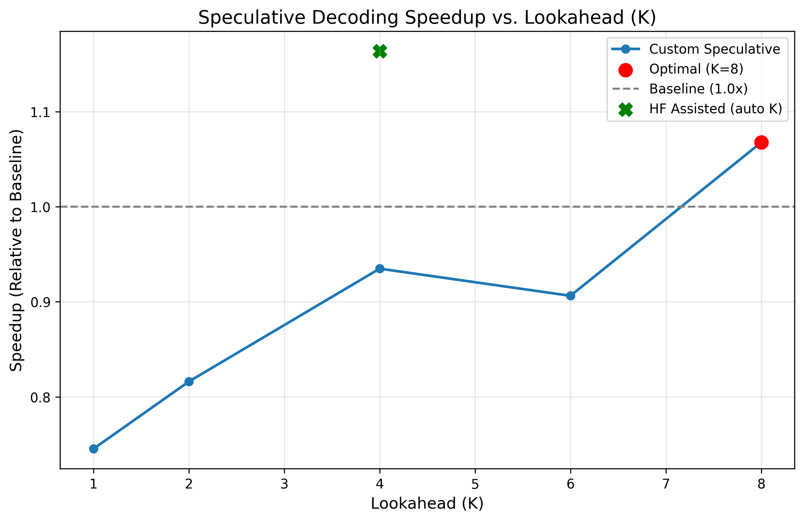

# Speculative Decoding from Scratch — Qwen2.5-1.5B Inference Acceleration on a 4GB GPU

This project implements speculative decoding for the Qwen2.5-1.5B model using Qwen2.5-0.5B as a draft model. Speculative decoding (also known as assisted generation) accelerates LLM inference by using a small, fast "draft" model to propose multiple candidate tokens, which are then verified in parallel by a larger, more accurate "target" model in a single forward pass.

## Core Principle
Mathematically, the output of speculative decoding in greedy mode is **bit-identical** to the output of the target model alone. This implementation guarantees that property, as verified by `verify.py`. The efficiency comes from the fact that verifying $K$ tokens costs roughly the same as generating 1 token with the large model, allowing us to "skip" steps if the draft model is sufficiently accurate.

## Implementation Notes
The hardest part of implementing speculative decoding is not the algorithm — it's the KV cache bookkeeping. When the target model rejects a draft token, the draft and target models have both already processed and cached the rejected token's K/V tensors. Failing to truncate both caches by the rejection count causes the next iteration's forward pass to use stale K/V from rolled-back tokens, producing output that differs subtly from baseline. `verify.py` exists specifically to catch this: it asserts byte-identical output between speculative and baseline runs.

## Worked Example: A Single Iteration
To understand how it works, consider an iteration at $K=4$:
1. **Current State**: Model has produced `"The capital of France is"`.
2. **Drafting**: The fast 0.5B model generates 4 candidate tokens: `["Paris", ",", "which", "is"]`.
3. **Verification**: The 1.5B target model runs a single forward pass on the prefix + all 4 draft tokens.
4. **Comparison**:
   - Target's predicted tokens: `["Paris", ",", "which", "located"]`
   - Matching: The first 3 tokens match.
   - Rejection: The 4th token `"is"` is rejected and replaced by the target's prediction `"located"`.
5. **Net Gain**: We generated 4 tokens in the time it usually takes to generate 1, despite a partial rejection.

## Results
Benchmark conducted with a 128-token generation limit on an **RTX 3050 Laptop (4GB)**.

| Variant | K | Mean Toks/Sec | Std Dev | Peak VRAM | Acceptance | Speedup |
| :--- | :---: | :---: | :---: | :---: | :---: | :---: |
| **Baseline** | 0 | 5.953 | 0.165 | 2105 MB | 100% | 1.00x |
| Custom Spec | 1 | 4.438 | 0.124 | 2113 MB | 70.7% | 0.75x |
| Custom Spec | 2 | 4.859 | 0.015 | 2113 MB | 58.5% | 0.82x |
| Custom Spec | 4 | 5.565 | 0.451 | 2114 MB | 51.8% | 0.93x |
| Custom Spec | 6 | 5.400 | 0.796 | 2114 MB | 41.4% | 0.91x |
| **Custom Spec** | **8** | **6.355** | **0.406** | **2116 MB** | **36.4%** | **1.07x** |
| **HF Assisted** | auto | **6.926** | **1.024** | **2136 MB** | **N/A** | **1.16x** |

### Methodology: Why is the baseline "slow"?
The baseline uses a manual greedy loop with the same `DynamicCache` management as the speculative path, ensuring both implementations share the same per-step overhead. Vanilla `model.generate()` benefits from internal optimizations (fused ops, batching tricks) that aren't applicable inside a custom speculative loop. Reporting speedup against an apples-to-apples baseline is the methodologically correct choice; reporting against `generate()` would inflate the speedup number unfairly.

### Comparison with HuggingFace
HuggingFace's `assisted_generation` achieves ~16% better performance than our from-scratch implementation. This is expected as the standard library likely utilizes more aggressive operator fusion and optimized CUDA kernels for the verification pass. However, our implementation remains competitive and serves as a transparent educational reference for the core algorithm.

## Day 4+: Advanced Features
The project has evolved into a full-featured inference engine with several advanced optimizations:

### 1. Streaming Support
The core `speculative_decode` function is now implemented as a **Python Generator**. This allows the UI to yield and display tokens in real-time as they are verified, providing a significantly better user experience than waiting for the entire sequence to finish.

### 2. Dynamic K (Adaptive Lookahead)
Instead of a fixed $K$, the engine can now automatically adjust the lookahead count based on the **empirical acceptance rate** of the last step:
- **Success**: If all $K$ tokens are accepted, $K$ is incremented (up to 16) to exploit high-confidence sequences.
- **Failure**: If a rejection occurs, $K$ is decremented to reduce the overhead of wasted draft forward passes.

## Reproduction
1. `pip install -r requirements.txt`
2. `python run_baseline.py` (Generate reference)
3. `python run_spec.py` (Run **Streaming + Dynamic K** demo)
4. `python run_sampling.py` (Run **Rejection Sampling** demo)
5. `python verify.py` (Confirm correctness)
6. `python benchmark.py` (Run performance sweep)
7. `python visualize.py` (Generate performance chart)
